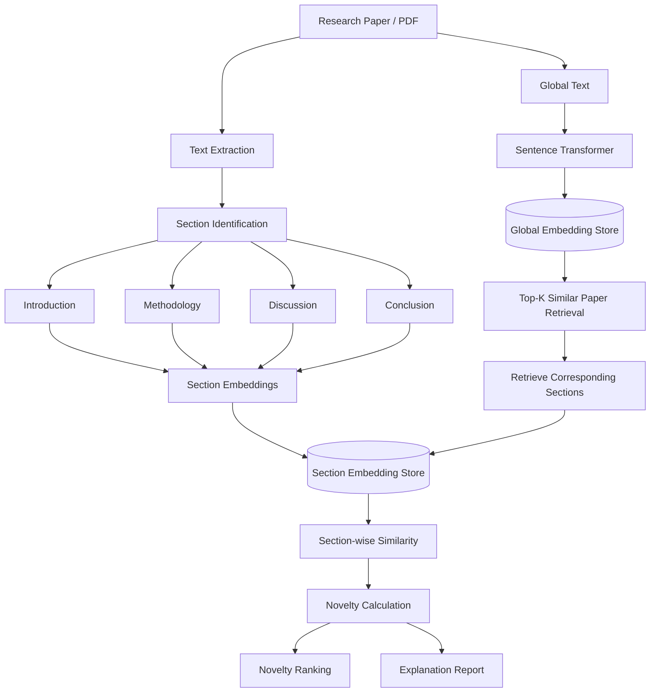

# RECNA — Retrieval-Augmented Novelty Estimation

> **RECNA** is a retrieval-augmented framework for estimating the novelty of a research paper by comparing its content with semantically similar prior works, both globally and section-wise.

---

## 📌 Overview

Research novelty is difficult to measure automatically because a paper may be similar to previous work in its **topic** while still introducing a genuinely new **method, discussion, or conclusion**.

RECNA addresses this problem by combining:

1. **Semantic retrieval** — find the most similar prior papers.
2. **Section-level comparison** — compare corresponding sections such as Introduction, Methodology, Discussion, and Conclusion.
3. **Similarity-to-novelty transformation** — convert semantic similarity into a novelty score.
4. **Novelty aggregation** — combine section-level evidence into an overall estimate.
5. **Interpretation** — provide explanations of why a paper appears similar or novel.

### Core idea

```text
                    NEW RESEARCH PAPER
                           │
                           ▼
                    Generate embedding
                           │
                           ▼
                 ┌─────────────────────┐
                 │ Retrieve Top-K       │
                 │ Similar Prior Works  │
                 └─────────────────────┘
                           │
             ┌─────────────┼─────────────┐
             ▼             ▼             ▼
        Prior Paper 1  Prior Paper 2  ... Prior Paper K
             │             │                  │
             └─────────────┼──────────────────┘
                           ▼
                  Section Extraction
                           │
         ┌─────────┬───────┼────────┬──────────┐
         ▼         ▼       ▼        ▼          ▼
   Introduction Methodology Discussion Conclusion ...
         │         │       │        │
         └─────────┴───────┼────────┴──────────┘
                           ▼
                 Section-wise Similarity
                           │
                           ▼
              Novelty = 1 − Similarity
                           │
                           ▼
                  Overall Novelty
```

---

## 🎯 Problem Statement

Traditional similarity systems often compare entire documents as a single unit.

This can hide important differences:

```text
Paper A                           Paper B

Introduction  ────────────────►  Introduction
       │                              │
       │     Highly similar          │
       └──────────────────────────────┘

Methodology   ────────────────►  Methodology
       │                              │
       │     Very different          │
       └──────────────────────────────┘
```

A global similarity score could incorrectly suggest that Paper B is not novel.

RECNA therefore asks a more useful question:

> **"How similar is each important section of this paper to the corresponding sections of its closest prior works?"**

---

# 🧠 RECNA Architecture



---

# 🔬 Methodology

## 1. Build the Research Corpus

RECNA uses a corpus of research papers as the historical knowledge base.

The current research pipeline uses a subset of **Computer Science arXiv papers from 2018–2023**, sourced from the **unarXive** dataset.

```text
                 Research Corpus
                       │
        ┌──────────────┼──────────────┐
        ▼              ▼              ▼
      Paper 1        Paper 2        Paper N
        │              │              │
        ▼              ▼              ▼
     Sections       Sections       Sections
        │              │              │
        └──────────────┼──────────────┘
                       ▼
                  Embeddings
                       │
                       ▼
                 Vector Database
```

The corpus was expanded to approximately **1,500 papers** during development.

---

# 2. Paper Processing

Each paper is converted from raw document content into structured text.

```text
PDF / Dataset Record
        │
        ▼
   Raw Paper Text
        │
        ▼
  Clean / Normalize
        │
        ▼
 Section Detection
        │
        ├── Introduction
        ├── Methodology
        ├── Discussion
        └── Conclusion
```

The section structure is important because RECNA does not treat the paper as one undifferentiated block.

---

# 3. Chunking

Long sections are divided into manageable chunks before generating embeddings.

The current implementation uses:

```text
Chunk size : 1000
Overlap    : 200
```

Conceptually:

```text
Original Section
──────────────────────────────────────────────────────────────►

[──────────── Chunk 1 ────────────]
                    [──────────── Chunk 2 ────────────]
                                        [──────────── Chunk 3 ────────────]
```

The overlap helps preserve contextual information between neighboring chunks.

---

# 4. Generate Embeddings

RECNA uses **Sentence-BERT / Sentence Transformers** to transform text into dense vector representations.

Current embedding dimensionality:

```text
384 dimensions
```

For example:

```text
Text
 │
 ▼
Sentence Transformer
 │
 ▼
[0.12, -0.43, 0.87, ..., 0.21]
        384 values
```

Semantically similar text should produce vectors that are close together in embedding space.

```text
                 Embedding Space

                     Paper A ●
                           ╲
                            ╲
                             ● Paper B

        Paper C ●


Paper A ↔ Paper B
High semantic similarity
```

---

# 5. Two-Level Embedding Strategy

RECNA maintains two conceptual embedding levels.

## Global Embeddings

Global embeddings represent the overall paper.

```text
                    Paper
                      │
                      ▼
              Global Embedding
                      │
                      ▼
             Global Collection
```

Purpose:

> Quickly identify papers that are semantically similar to the target paper.

---

## Section Embeddings

Section embeddings represent individual sections.

```text
                 Paper
                   │
        ┌──────────┼───────────┐
        ▼          ▼           ▼
  Introduction  Methodology  Discussion
        │          │           │
        ▼          ▼           ▼
    Embedding   Embedding   Embedding
```

Purpose:

> Determine where the similarity actually occurs.

---

# 🗄️ Vector Storage

RECNA uses **ChromaDB** for persistent vector storage.

Conceptually:

```text
                ChromaDB
                   │
          ┌────────┴────────┐
          ▼                 ▼
   Global Collection   Section Collection
          │                 │
          ▼                 ▼
    Paper embeddings   Section embeddings
```

The project also maintains local embedding backups where required for reproducibility and recovery.

---

# 🔎 6. Retrieve Top-K Similar Papers

Given a new paper:

```text
             Target Paper
                  │
                  ▼
          Generate embedding
                  │
                  ▼
        Search Global Collection
                  │
                  ▼
          ┌───────────────┐
          │ Similar Papers│
          └───────────────┘
             │    │    │
             ▼    ▼    ▼
            P1   P2   P3 ... PK
```

The system retrieves the **Top-K semantically closest prior works**.

This is the retrieval component of **Retrieval-Augmented Novelty Estimation**.

---

# 🧩 7. Section-Wise Comparison

After retrieving similar papers, RECNA compares corresponding sections.

For example:

```text
Target Paper                    Prior Paper

Introduction  ───────────────►  Introduction
Methodology   ───────────────►  Methodology
Discussion    ───────────────►  Discussion
Conclusion    ───────────────►  Conclusion
```

For every section:

```text
Target Section
      │
      ▼
Generate Embedding
      │
      ▼
Compare with retrieved prior sections
      │
      ▼
Similarity Score
```

---

# 📐 8. Similarity Calculation

RECNA uses **cosine similarity** to estimate semantic closeness.

The cosine similarity between two vectors is:

```text
              A · B
cos(A,B) = ─────────────
            ||A|| ||B||
```

Interpretation:

```text
Similarity
   1.0 ┤████████████████████  Very similar
       │
   0.8 ┤████████████████      Highly similar
       │
   0.5 ┤██████████            Moderately similar
       │
   0.2 ┤████                  Weakly similar
       │
   0.0 ┤                      Very different
```

A high similarity means the target section resembles existing research.

A low similarity means the target section is semantically different.

---

# 💡 9. From Similarity to Novelty

RECNA uses the basic transformation:

```text
Novelty = 1 − Similarity
```

Therefore:

```text
Similarity = 0.90
        │
        ▼
Novelty = 1 − 0.90
        │
        ▼
Novelty = 0.10
```

And:

```text
Similarity = 0.30
        │
        ▼
Novelty = 1 − 0.30
        │
        ▼
Novelty = 0.70
```

### Interpretation

| Similarity | Novelty | Interpretation |
|---:|---:|---|
| 0.95 | 0.05 | Very low novelty |
| 0.80 | 0.20 | Low novelty |
| 0.60 | 0.40 | Moderate novelty |
| 0.40 | 0.60 | High novelty |
| 0.20 | 0.80 | Very high novelty |

> **Important:** This is a semantic novelty estimate, not a definitive claim that a paper is scientifically original.

---

# 📊 10. Section-Level Novelty

Suppose a target paper produces:

```text
Introduction
Similarity = 0.82
Novelty    = 0.18

Methodology
Similarity = 0.35
Novelty    = 0.65

Discussion
Similarity = 0.57
Novelty    = 0.43

Conclusion
Similarity = 0.44
Novelty    = 0.56
```

This gives a much richer picture than one global score.

```text
Section         Similarity       Novelty

Introduction    ████████████████  0.82
Methodology     ███████          0.35
Discussion      ███████████      0.57
Conclusion      █████████        0.44
```

The example suggests that the **Methodology** is the most distinctive section.

---

# 🏆 11. Overall Novelty Strategy

RECNA experimented with several ways of aggregating section-level evidence, including:

- Mean similarity
- Weighted similarity
- Maximum section novelty / minimum similarity

The current research direction emphasizes the **strongest section-level novelty signal** using the most distinctive section among the evaluated sections.

Conceptually:

```text
Section Novelty Scores

Introduction ─── 0.18
Methodology  ─── 0.65  ◄── strongest novelty
Discussion   ─── 0.43
Conclusion   ─── 0.56

                    │
                    ▼

             Overall signal
                 = 0.65
```

This approach is useful when a paper can be highly similar to previous work in its background while introducing a substantially different method.

---

# 🔥 Why Top-K Retrieval Matters

Comparing a new paper against only one previous paper can produce misleading results.

Instead:

```text
                     Target Paper
                           │
                           ▼
                     Retrieve Top-K
                           │
            ┌──────────────┼──────────────┐
            ▼              ▼              ▼
          Paper 1        Paper 2        Paper K
            │              │              │
            ▼              ▼              ▼
       Similarity       Similarity     Similarity
            │              │              │
            └──────────────┼──────────────┘
                           ▼
                    Aggregate Evidence
```

This gives RECNA multiple reference points from the existing literature.

---

# 🌡️ Novelty Heatmap

One of the key visualizations is a section-wise similarity heatmap.

Conceptually:

```text
                 Prior Works
             P1    P2    P3    P4    P5
          ┌─────┬─────┬─────┬─────┬─────┐
Intro     │ ███ │ ███ │ ██  │ ███ │ ██  │
          ├─────┼─────┼─────┼─────┼─────┤
Method    │ ██  │ █   │ ██  │ █   │ █   │
          ├─────┼─────┼─────┼─────┼─────┤
Discuss   │ ███ │ ██  │ ███ │ ██  │ ██  │
          ├─────┼─────┼─────┼─────┼─────┤
Conclusion│ ██  │ █   │ ██  │ ██  │ █   │
          └─────┴─────┴─────┴─────┴─────┘

█ = stronger semantic similarity
```

This makes it possible to see **where a paper overlaps with existing research**.

---

# 🧪 Evaluation

A major challenge is that **novelty has no perfect ground-truth label**.

RECNA therefore explores citation counts as a proxy for evaluating whether estimated novelty relates to research impact.

The evaluation pipeline is:

```text
RECNA Novelty Scores
        │
        ▼
   Compare against
   citation counts
        │
        ▼
   Statistical Analysis
        │
   ┌────┼─────────┐
   ▼    ▼         ▼
Pearson Spearman Kendall
```

The project evaluates relationships using:

- **Pearson correlation**
- **Spearman correlation**
- **Kendall rank correlation**

A sample of approximately **50 papers** was used for evaluation during development.

> Citation count is only a proxy. A high citation count does not necessarily mean high novelty, and a highly novel paper may initially have few citations.

---

# 📈 Global vs Section-Level Interpretation

A major research question in RECNA is the difference between:

### Global similarity

```text
Target Paper
     │
     ▼
One overall embedding
     │
     ▼
Compare with prior papers
     │
     ▼
Global similarity
```

### Section similarity

```text
Target Paper
     │
     ├── Introduction ──► Compare
     ├── Methodology  ──► Compare
     ├── Discussion   ──► Compare
     └── Conclusion   ──► Compare
```

This distinction helps answer:

> **Is the paper similar because it works in the same research area, or because its actual contribution resembles previous work?**

---

# 🤖 LLM-Assisted Interpretation

Semantic similarity alone cannot explain *why* two sections are similar.

RECNA therefore explores LLM-based analysis for:

- Section classification
- Section parsing
- Novelty explanation
- Comparing methodological contributions
- Generating human-readable reports

The intended flow is:

```text
Similarity Detection
        │
        ▼
Identify highly similar / different sections
        │
        ▼
LLM Analysis
        │
        ▼
Explain:
"What is similar?"
"What is different?"
"Why might this matter?"
        │
        ▼
Human-readable Novelty Report
```

The LLM is intended to **interpret the evidence**, rather than replace the retrieval and similarity pipeline.

---

# 🖥️ Planned User Interface

A planned Streamlit interface can allow a researcher to upload a PDF and receive an automated novelty analysis.

```text
┌─────────────────────────────────────────────┐
│              RECNA Dashboard                │
├─────────────────────────────────────────────┤
│                                             │
│       Upload Research Paper (PDF)           │
│                                             │
│              [ Upload PDF ]                 │
│                                             │
├─────────────────────────────────────────────┤
│              Novelty Summary                │
│                                             │
│  Overall Novelty: ████████████░░  0.72      │
│                                             │
├─────────────────────────────────────────────┤
│ Section Analysis                            │
│                                             │
│ Introduction   0.18 novelty                 │
│ Methodology    0.72 novelty                 │
│ Discussion     0.45 novelty                 │
│ Conclusion     0.58 novelty                 │
│                                             │
├─────────────────────────────────────────────┤
│ Similar Prior Works                         │
│                                             │
│ 1. Paper A                                  │
│ 2. Paper B                                  │
│ 3. Paper C                                  │
│                                             │
└─────────────────────────────────────────────┘
```

---

# 🔄 End-to-End Pipeline


---

# 🗂️ Suggested Project Structure

```text
RECNA/
│
├── data/
│   ├── raw/
│   ├── processed/
│   └── metadata/
│
├── embeddings/
│   ├── global/
│   └── sections/
│
├── chroma_db/
│   ├── global_collection/
│   └── section_collection/
│
├── src/
│   ├── preprocessing/
│   ├── extraction/
│   ├── embeddings/
│   ├── retrieval/
│   ├── similarity/
│   ├── novelty/
│   ├── llm/
│   └── evaluation/
│
├── visualization/
│   ├── heatmaps/
│   └── reports/
│
├── app/
│   └── streamlit_app.py
│
├── notebooks/
│
├── requirements.txt
├── README.md
└── .gitignore
```

> The exact structure may differ from the current implementation; this layout represents a clean organization for the complete RECNA pipeline.

---

# 🛠️ Technology Stack

| Component | Technology |
|---|---|
| Programming | Python |
| Embeddings | Sentence Transformers / Sentence-BERT |
| Vector Database | ChromaDB |
| Similarity | Cosine Similarity |
| Dataset | unarXive / Computer Science arXiv |
| LLM Processing | LLaMA / Groq API during experimentation |
| Visualization | Plotly / Python visualization tools |
| UI | Streamlit |
| Evaluation | Pearson, Spearman, Kendall correlation |

---

# 🧮 Mathematical Formulation

Let:

- \(P\) = target paper
- \(R = \{R_1, R_2, ..., R_K\}\) = Top-K retrieved papers
- \(S\) = set of evaluated sections
- \(E(P_s)\) = embedding of section \(s\) of paper \(P\)

For each section:

\[
Sim(P_s,R_{k,s})
=
\frac{
E(P_s)\cdot E(R_{k,s})
}{
\|E(P_s)\|\|E(R_{k,s})\|
}
\]

The section-level novelty can then be represented as:

\[
Novelty(P_s) = 1 - Similarity(P_s)
\]

The system evaluates the similarity of the target section against the corresponding sections of retrieved prior works and derives a section-level novelty signal.

---

# 🔍 Example

Imagine a new AI paper has the following scores:

```text
                       Similarity
                       ↓

Introduction        ████████████████  0.84
Methodology         ██████            0.31
Discussion          ███████████       0.56
Conclusion          ████████          0.42
```

Converted to novelty:

```text
                       Novelty
                       ↓

Introduction        ███               0.16
Methodology         ██████████████    0.69
Discussion          █████████          0.44
Conclusion          ███████████       0.58
```

### Interpretation

The paper appears strongly related to existing literature in its **Introduction**, which is expected because introductions often describe established research areas.

However, its **Methodology** is substantially more distinct.

This is exactly the type of distinction RECNA is designed to expose.

---

# ⚠️ Limitations

RECNA should be interpreted as a **novelty estimation system**, not an authoritative originality detector.

Important limitations include:

### 1. Embedding limitations

Semantic embeddings may consider two technically different methods similar if their language and concepts overlap strongly.

### 2. Corpus coverage

A paper cannot be identified as similar to literature that is absent from the retrieval corpus.

```text
Complete Literature
        │
        ├── Included in corpus ──► RECNA can retrieve
        │
        └── Missing ─────────────► RECNA cannot compare
```

### 3. Citation count is an imperfect proxy

Citations measure many things besides novelty, including visibility, popularity, field size, and publication age.

### 4. Section extraction errors

Incorrect section classification can affect section-level novelty calculations.

### 5. Novelty is multidimensional

A paper may be novel in:

- Problem formulation
- Dataset
- Algorithm
- Architecture
- Experimental methodology
- Theory
- Application
- Interpretation

A single numerical score cannot capture all of these dimensions.

---

# 🚀 Future Work

The next development stages include:

- [ ] Complete LLM-based section parsing and classification
- [ ] Improve section-level retrieval
- [ ] Develop stronger novelty aggregation strategies
- [ ] Generate explainable novelty reports
- [ ] Compare global and section-level novelty systematically
- [ ] Expand the research corpus
- [ ] Improve evaluation methodology
- [ ] Build the Streamlit PDF-upload interface
- [ ] Add interactive similarity heatmaps
- [ ] Add prior-work comparison cards
- [ ] Generate downloadable novelty reports
- [ ] Investigate domain-specific novelty scoring
- [ ] Evaluate against expert human judgments

---

# 📚 Research Concept in One Picture

```text
                         RECNA
                          │
          ┌───────────────┴────────────────┐
          │                                │
     RETRIEVAL                         ANALYSIS
          │                                │
          ▼                                ▼
  Find similar papers             Compare sections
          │                                │
          ▼                                ▼
       Top-K                    Similarity / Difference
          │                                │
          └───────────────┬────────────────┘
                          ▼
                  NOVELTY ESTIMATION
                          │
                          ▼
                  EXPLANATION / REPORT
```

---

# 🎓 Research Contribution

RECNA's central idea is to move beyond **document-level semantic similarity** toward **retrieval-augmented, section-aware novelty estimation**.

Instead of asking only:

> "Is this paper similar to previous papers?"

RECNA attempts to answer:

> **"Which parts of this paper are similar to prior research, which parts are different, and how can those differences contribute to an estimate of research novelty?"**

---

# 📄 Status

**Project:** Retrieval-Augmented Novelty Estimation (RECNA)

**Current stage:** Research prototype / development

**Corpus:** Computer Science research papers, primarily 2018–2023

**Core pipeline:**  
`Corpus → Embeddings → Top-K Retrieval → Section Comparison → Similarity → Novelty → Explanation`

---

# 👥 Contributors

Add project members here:

```text
- Name — Role
- Name — Role
- Name — Role
```

---

# 📜 License

Add the appropriate project license here, for example:

```text
MIT License
```

if the project is intended to be released under MIT.
